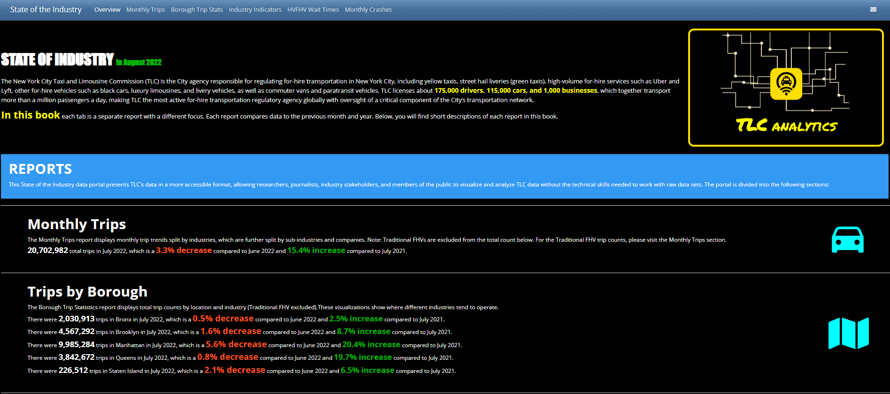

# state_of_the_industry_app

## Check It Out

- See the app on the TLC's website here: https://analytics-tlc.github.io/state_of_industry

## Overview

This State of the Industry data portal presents TLC’s data in a more accessible format, allowing researchers, journalists, industry stakeholders, and members of the public to visualize and analyze TLC data without the technical skills needed to work with raw data sets.

The portal is divided into the following sections::

- &#x1F4C8; **Monthly Trips** 

    The Monthly Trips report displays monthly trip trends split by industries, which are further split by sub-industries and companies. Note: Traditional FHVs are excluded from the total count below. For the Traditional FHV trip counts, please visit the Monthly Trips section.
    
- &#x1F4C8; **Trips by Borough** 

    The Borough Trip Statistics report displays total trip counts by location and industry (Traditional FHV excluded).These visualizations show where different industries tend to operate.

- &#x1F4C8; **Industry Indicators** 

    The Industry Indicators are the metrics that TLC publishes on its website. They cover a myriad of relevant statistics for the industries that TLC regulates.

- &#x1F4C8; **Wait Times** 

    The Wait Times report displays wait time by location for the HVFHV industry. Wait time is a useful metric in determining supply and demand in different areas of the City.

- &#x1F4C8; **Crashes** 

    The Crash report displays crash, injury, and fatality counts by month and industry. The report breaks down analysis by industry to determine crash, injury, and fatality counts for each industry segment.

 

## &#x1F4C8; **Frequency of Updates & Diagrams**

The app will be updated once a month on the 25th of each month. There is a delay in us receiving and publishing data to the Open Data portal and this is reflected in the app. For example: on 26th of May the latest data on the app will be from March. Here is the whole workflow: 

 

### Overall Data Processing

**The DataBricks in the diagram mean Python, R, and other scripting to facilitate the transitions of data**
    

### State of the Industry Data Flow

## &#x1F64F; Thank you!

This dashboard was built using many great tools in the R ecosystem. Thanks to all of the developers of these open source packages:

- [flexdashboard]
- [RMarkdown]
- [plotly]
- [tidyverse]
- [shinycssloaders]
- [DT]

...and many more. For a full list of project dependencies, see the Rmd file.
    
---

This dashboard was built by [Nikita Voevodin] and is owned by the NYC Government.

[Open Data]: https://www.youtube.com/watch?v=LJ8YkGjdcuA
[Nikita Voevodin]: https://nikitavoevodin.com
[DataHub]: https://tlcanalytics.shinyapps.io/datahub/
[shinydashboard-fork]: https://github.com/gadenbuie/shinydashboard/tree/dev
[adminlte-ocean-next]: https://github.com/gadenbuie/AdminLTE/tree/ocean-next
[datatable]: https://www.datatables.net/
[datatables]: https://www.datatables.net/
[app-rstudio-cloud]: https://rstudio.cloud/spaces/12362/project/258314
[app-shinyapps]: https://gadenbuie.shinyapps.io/tweet-conf-dash/
[mit-license]: https://choosealicense.com/licenses/mit/
[repo]: https://github.com/gadenbuie/tweet-conf-dash/
[shiny]: http://shiny.rstudio.com/
[rtweet]: https://rtweet.info
[shinydashboard]: https://rstudio.github.io/shinydashboard/
[plotly]: https://plot.ly/
[tidyverse]: https://tidyverse.org
[shinycssloaders]: https://github.com/andrewsali/shinycssloaders
[DT]: https://rstudio.github.io/DT/
[adminlte]: https://adminlte.io/
[bootstrap]: https://getbootstrap.com/
